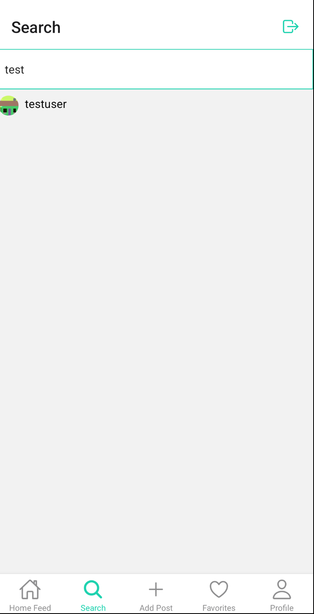

Lumigram is an instagram clone implemented in React Native. The app should have the following screens:

* [Figma Diagram](https://www.figma.com/design/J7aPZsxe09G0hIBuVBdxuZ/Lumigram?node-id=0-1&t=k6s5DLat592qJT8F-1)
* 

#### Login Screen

**Login Screen Requirements:**

* When a user opens the app the login screen should be the default screen.
* Clicking "Create a new account" should take the user to the register screen.
* If the wrong email or password is entered, the user should see an alert message.
* If the user enters the correct email and password, the user should be redirected to the home feed screen.

#### Register Screen

**Register Requirements:**

* Clicking "Login to an existing account" should take the user to the login screen.
* When a user enters an email and password an account is created and the user is redirected to the home feed screen.

#### Home Screen

#### Search Screen

**Search Screen Requirements:**

* There is an input used to search for other users.
* As the user types a list of users avatars and usernames appear that match the users search.
* Clicking on a user navigates to the user profile screen for that user.

#### Add Post Screen

**Add Post Screen Requirements:**

* Clicking "Choose a photo" opens the image picker.
* When a user selects the image the image is displayed on the screen and there is an input to cature a caption for the post.
* When a user clicks save the image is uploaded to firebase and a post is created. the post should appear on the home feed screen.

#### Favorites Screen

#### Profile Screen

#### Edit Profile Screen

