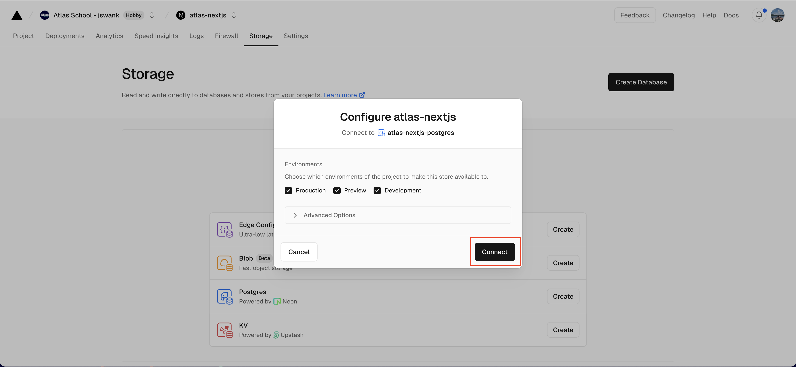

We will be using vercel to host our application including our database. Before getting started you will need to create a vercel account at [https://vercel.com/](https://vercel.com/). Once your account is created push all of your current code to github. You will need to connect github to vercel.

### Setting up Vercel Project

Create a new project in vercel. This will hold your application and database. You will be importing the project from github:

If you have not already connected github you will need to connect your github. Once github is connected you will see your repositories from github. Find the repo that holds your `atlas-nextjs` code and import this repository:

From here you will be asked to give your project a name. You can leave the default name and settings. Vercel will detect this is a nextjs project and set it up correctly. Just click deploy:

**Important:** It is very likely the first deployment will fail. That is ok. It is because the database has not been set up yet. We will fix this in the next section.

Once your project has been created click on the storage tab:

From here select to create a postgres database:

You may be prompted to accept the terms of service. Just click accept:

From here you can set the database name and location. The defaults are fine. Just hit create:

Then you will be asked which environments to make the database accessible from. Just leave all the environments checked and hit connect:

Once the database is created you will need to copy the environment variable to give your local nextjs application access to the database. Click on the storage tab and select you rdatabase. From the databases page, select **.env.local** and then click **"Copy Snippet"** to copy the environment variables:

Create a new file in your project called **.env.local** and paste the environment variables into this file. **Important:** this file should be gitignored. Do not check it into github. This is only for your local development environment.

Finally you can seed your database. There is already code to create the database tables and add some starter data in `app/seed/route.ts`. This creates an API endpoint you can hit to run the code. Make sure your app is running and navigate to `http://localhost:3000/seed`. If your app is able to connect to your database you should see **"Database Seeded Successfully"**.

You can browse the database visually in the console in vercel. From the database page where you got the local environment variables, scroll down until you see "Data" on the left side bar. Select Browse. Then select a table you would like to view from the dropdown. You should be able to see the starter topics and questions in the tables in the database.

### Getting Familiar with the database

There are three tables in the database: users, topics, and questions.

**Users:** This table holds the email and passwords for the users to login. By default there is one user email: user@atlasmail.com password: 123456. If you want to add more users add them to `lib/placeholder-data.ts` and re hit the seed endpoint.

**Topics:** a topic is a collection of questions. Each topic has a name that will appear in the sidebar in our application.

**Questions:** This table holds the questions for each topic.