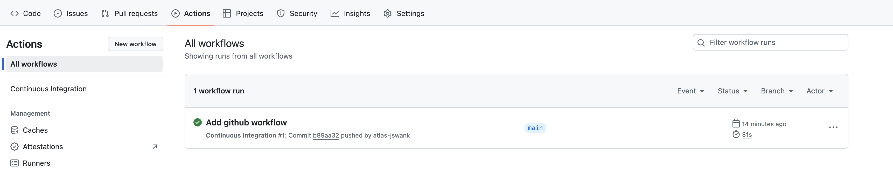

Unit testing in React is a crucial practice that ensures individual components and functions within an application work as expected. By isolating these components and testing them independently, developers can catch bugs early in the development process, leading to more reliable and maintainable code. 

React's component-based architecture lends itself well to unit testing, as each component can be treated as a small, testable unit. Tools like Vitest and React Testing Library are commonly used to create and run these tests, allowing developers to simulate user interactions, check outputs, and verify that components render correctly under different conditions. Through unit testing, React applications become more robust, easier to refactor, and better equipped to handle future changes.

### Vitest

[Vitest](https://vitest.dev/) is a fast, modern testing framework for JavaScript and TypeScript applications, designed to work seamlessly with Vite, a popular build tool. It offers a similar API to Jest, making it easy for developers familiar with Jest to adopt Vitest. The key advantage of Vitest lies in its integration with Vite, allowing it to leverage Vite's fast, efficient build process for running tests. This makes Vitest particularly well-suited for modern web applications, where speed and developer experience are paramount.

Vitest supports features like snapshot testing, mocking, and coverage reports, and it can be used to test both unit and end-to-end components. It's known for its speed, thanks to its ability to run tests in parallel and hot-reload test files, which significantly enhances the developer's productivity during the testing process.

### React Testing Library

[React Testing Library](https://testing-library.com/docs/react-testing-library/intro/) provides utilities to render components in a test environment, query the rendered output, and simulate user interactions such as clicks, typing, and form submissions. It emphasizes best practices like accessibility and encourages testing components as a whole, including their effects and interactions with other components or services. By prioritizing how components are used rather than how they're built, React Testing Library helps ensure that tests remain aligned with the actual user experience.

### Snapshot testing

Snapshot testing is a technique used to verify that the output of a component or function remains consistent over time. It works by capturing a "snapshot" of the rendered output (usually in the form of a JSON object) during the initial test run. This snapshot is then saved and compared against future test runs. If the output changes, the test will fail, alerting the developer to a potential unintended change in the component's behavior or appearance.

Snapshot testing is particularly useful in UI testing, where the structure of the rendered component (including its HTML, styles, and other outputs) can be compared against the expected structure to detect changes.

### Writing snapshot tests

Here’s an example of how you might use snapshot testing in a React component with Vitest:

**1. Install Vitest and React Testing Library (if you haven't already):**

```bash
npm install vitest @testing-library/react @testing-library/jest-dom jsdom
```

**2. Configure vite to use jsdom**

```tsx
//vite.config.ts
export default defineConfig({
  plugins: [react()],
  test: {
    environment: 'jsdom'
  },
});
```
**3. Create a React Component:**
```tsx
//Button.tsx
type Props = {
  label: string;
};

export function Button({ label }: Props) {
  return <button>{label}</button>;
}
```
**4. Write a Snapshot Test:**

```tsx
//Button.test.tsx
import { render } from "@testing-library/react";
import { expect, test } from "vitest";
import { Button } from "./Button";

test("Button renders correctly", () => {
  const { container } = render(<Button label="Click me" />);
  expect(container).toMatchSnapshot();
});

```

In this example:

* `render(<Button label="Click me" />)` renders the Button component.
* `toMatchSnapshot()` compares the current output to the saved snapshot.

**5. Run the Test:**

```bash
npx vitest run
```

During the first run, Vitest will create a snapshot file that contains the rendered output of the Button component. This file is stored in a `__snapshots__` directory next to your test file.


```tsx
// __snapshots__/Button.test.tsx.snap
// Vitest Snapshot v1, https://vitest.dev/guide/snapshot.html

exports[`Button renders correctly 1`] = `
<div>
  <button>
    Click me
  </button>
</div>
`;
```

Alertnativley you can use `toMatchInlineSnapshot()` matcher to output the snapshot inline in the test. This works well for small components but can be a bit verbose for larger components.

**6. Handling Snapshot Changes:**

If you make changes to the Button component (e.g., changing the label or adding styles), the next test run will fail if the output no longer matches the snapshot. If the changes are intentional, you can update the snapshot by running:

```bash
npx vitest -u
```
This command will regenerate the snapshot to match the new output.

#### Benefits and Use Cases

* **UI Regression Testing:** Snapshot testing is excellent for catching unintended changes in the UI.
* **Quick Feedback:** Developers get quick feedback when a component's output changes.
* **Simple to Implement:** Snapshot tests are easy to write and can cover large parts of your UI with minimal code.

 ### Writing tests with React Testing Library

Snapshot testing should be used judiciously. Over-reliance on snapshots can lead to brittle tests that require frequent updates even for minor changes. It's best to combine snapshot testing with other forms of testing to ensure comprehensive coverage.

Here’s a unit test example for the FooBar component using React Testing Library. The test will verify that the component behaves correctly when the buttons are clicked, toggling the display of "Foo" and "Bar".

 ```tsx
 //FooBar.tsx
import { useState } from "react";

export function FooBar() {
  const [showFoo, setShowFoo] = useState(true);
  const [showBar, setShowBar] = useState(false);

  return (
    <div>
      {showFoo && <span>Foo</span>}
      {showBar && <span>Bar</span>}
      <button onClick={() => setShowFoo(!showFoo)}>
        Toggle Foo
      </button>
      <button onClick={() => setShowBar(!showBar)}>
        Toggle Bar
      </button>
    </div>
  );
}
```

```tsx
// FooBar.test.js
import { render, screen, fireEvent } from "@testing-library/react";
import { expect, test } from "vitest";

test('toggles "Foo" visibility when the "Toggle Foo" button is clicked', () => {
  render(<FooBar />);

  const toggleFooButton = screen.getByText("Toggle Foo");

  // Click the "Toggle Foo" button to hide "Foo"
  fireEvent.click(toggleFooButton);
  expect(screen.queryByText("Foo")).not.toBeInTheDocument();

  // Click the "Toggle Foo" button again to show "Foo"
  fireEvent.click(toggleFooButton);
  expect(screen.getByText("Foo")).toBeInTheDocument();
});

```
**Toggling "Foo":** This test simulates clicking the "Toggle Foo" button to hide "Foo". After the first click, `screen.queryByText('Foo')` confirms that "Foo" is no longer in the DOM. Clicking the button again should bring "Foo" back, and `screen.getByText('Foo')` verifies this.

```tsx
// FooBar.test.js
import { render, screen, fireEvent } from "@testing-library/react";
import { expect, test } from "vitest";

test('toggles "Bar" visibility when the "Toggle Bar" button is clicked', () => {
  render(<FooBar />);

  const toggleBarButton = screen.getByText("Toggle Bar");

  // Click the "Toggle Bar" button to show "Bar"
  fireEvent.click(toggleBarButton);
  expect(screen.getByText("Bar")).toBeInTheDocument();

  // Click the "Toggle Bar" button again to hide "Bar"
  fireEvent.click(toggleBarButton);
  expect(screen.queryByText("Bar")).not.toBeInTheDocument();
});
```

**Toggling "Bar":** This test simulates clicking the "Toggle Bar" button to show "Bar". `screen.getByText('Bar')` verifies that "Bar" appears after the first click. Clicking the button again should hide "Bar", and `screen.queryByText('Bar')` ensures it’s no longer in the DOM.

### Testing react hooks
  
Testing React hooks with the `renderHook` function from React Testing Library is a common practice for isolating and verifying the behavior of custom hooks. Here's an example of unit testing a simple custom hook using `renderHook`.

Let's create a custom hook called `useToggle` that manages a boolean state and provides a function to toggle it.

```tsx
// useToggle.tsx
import { useState } from 'react';

export function useToggle(initialValue = false): [boolean, () => void] {
  const [value, setValue] = useState(initialValue);

  const toggleValue = () => {
    setValue((prevValue) => !prevValue);
  };

  return [value, toggleValue];
}
```

```tsx
// useToggle.test.js

test("should toggle the value", () => {
  const { result } = renderHook(() => useToggle());

  const [value, toggleValue] = result.current;

  // Initial value should be false
  expect(value).toBe(false);

  // Toggle the value to true
  act(() => {
    toggleValue();
  });

  expect(result.current[0]).toBe(true);

  // Toggle the value back to false
  act(() => {
    toggleValue();
  });

  expect(result.current[0]).toBe(false);
});

```

This example demonstrates how to use renderHook to test a custom React hook. By isolating the hook and interacting with it directly, you can verify its behavior independently from any components that might use it. This approach is particularly useful for ensuring the correctness of complex hooks or hooks that encapsulate reusable logic.

### Code Coverage

Code coverage reports are tools used in software testing to measure the extent to which your codebase is tested by automated tests. These reports provide a detailed analysis of which lines, functions, branches, and statements in your code have been executed during testing, highlighting areas that have been tested and those that have not. A high code coverage percentage indicates that a large portion of your code is being tested, which can give confidence in the reliability and robustness of the software. 

It's important to note however that high coverage alone doesn't guarantee quality—tests must also be meaningful and validate the correct behavior of the code. Code coverage reports are valuable for identifying untested parts of the code, guiding the development of additional tests, and improving overall code quality.

### Running code coverage reports

To run code coverage with Vitest, you'll need to enable coverage reporting in your Vitest configuration. Vitest uses v8 under the hood to generate coverage reports. Here’s how you can set it up and run code coverage in your project:

```bash
npm i -D @vitest/coverage-v8
```

To test with coverage enabled, you can pass the --coverage flag in CLI.

```bash
npx vitest --coverage
```

By running `npx vitest run --coverage`, Vitest will generate code coverage reports that help you understand which parts of your code are tested and which are not. You can customize the reports through the configuration file, choosing from different report formats and specifying which files or directories to include or exclude.

### Continuous Integration

Continuous Integration (CI) is a software development practice where developers frequently merge their code changes into a central repository, after which automated builds and tests are run. This practice helps ensure that the codebase remains stable and that new changes do not break existing functionality. GitHub Actions is a powerful tool for implementing CI by automating workflows directly in your GitHub repository.

**Create a Workflow File**

First, create a YAML file in your repository within the `.github/workflows` directory. Name file `ci.yml`.

**Define the Workflow Configuration**

Edit the `ci.yml` file to define the workflow configuration. Here’s a simple example of a workflow that installs dependencies, runs unit tests and test coverage on every push to the main branch:

```yaml
name: Continuous Integration
on:
  push:
    branches:
      - main
jobs:
  test:
    runs-on: ubuntu-latest
    steps:
      - name: Checkout Source Code
        uses: actions/checkout@v4
      - name: Set up Node.js
        uses: actions/setup-node@v4
        with:
          node-version: '20'
      - name: Install dependencies
        run: npm install
      - name: Run Unit Tests
        run: npm run test
      - name: Run Test Coverage
        run: npm run coverage
```

**Understanding the Configuration**

* **name:** This specifies the name of the workflow.
* **on:** This defines the events that will trigger the workflow. In this case, any push to the main branch.
* **jobs:** This section defines the jobs that the workflow will execute. The example contains a single job called `test`.
* **runs-on:** This specifies the type of virtual environment. Here, it uses the latest version of Ubuntu.
* **steps:** These are the sequential tasks that the workflow executes. It uses existing GitHub Actions like `actions/checkout` to clone the repository and `actions/setup-node` to set up Node.js. It then runs commands to install dependencies and execute tests

**Activate and Monitor the Workflow**

Once you commit and push this `.yml` file to your repository, GitHub Actions will automatically recognize it and start running the defined workflow based on the trigger events. You can monitor the progress and results of these actions in the “Actions” tab of your GitHub repository.



**Benefits of CI with GitHub Actions**

* **Automation:** Every commit is automatically built and tested, reducing manual work and speeding up the development process.
* **Immediate Feedback:** Developers get immediate feedback on their commits, allowing them to quickly fix issues.
* **Consistency:** Ensures that tests are consistently run in a clean, standardized environment.