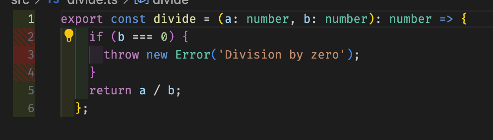
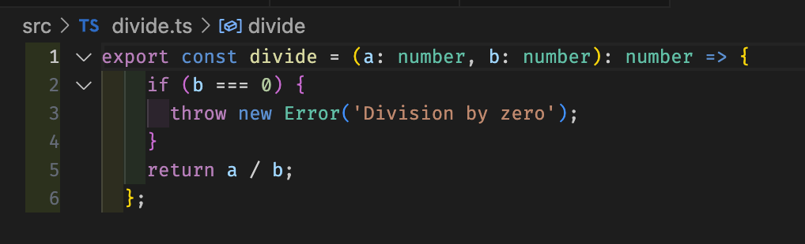

Unit testing is a critical aspect of modern software development. It ensures that individual units of code—usually functions or methods—work as intended. Writing high-quality unit tests can save time, reduce bugs, and make your codebase more maintainable. In this blog post, we'll explore best practices for writing effective unit tests in TypeScript.


### Why Unit Testing Matters

Unit tests are small, isolated tests that verify the behavior of individual functions or modules. The benefits of writing unit tests include:

* **Catching bugs early:** Testing each part of the code independently helps detect issues before they escalate.
* **Supporting refactoring:** With unit tests in place, you can confidently refactor code, knowing that tests will ensure nothing breaks.
* **Avoid Regressions:** Unit tests help prevent regressions by ensuring that existing functionality does not break when adding new features.
* **Documentation:** Unit tests act as a form of living documentation, showing how a particular function or class is expected to behave.


### Your Role as a Developer in Testing

As a developer it is likely you will be expected to write quality tests for your code as part of every code change. It will be expected that your code is testable, you have written tests that cover the functionality of your code, and your tests are not flaky and pass consistently.

**Important:** Never merge failing or flaky tests into your main branch. This will become a blocker for your entire team. Teams often rely on automated tests to pass before deploying code to production. If you merge tests that are failing, you've now blocked all new features and bug fixes merged by your teamates from being deployed until you fix the tests or revert your changes. Some teams may expect to be able to deploy multiplt times a day in order to make sure bugs and features reach customers in a timely fashion. 

### Tips for Writing Quality Unit Tests

We've discussed why unit tests are important to software developersHere are some good practices to follow when writing unit tests.

#### Follow the Arrange, Act, Assert (AAA) Pattern

The AAA pattern helps structure your tests clearly by separating them into three distinct steps: **Arrange**, **Act**, and **Assert**. In the **Arrange** step, you prepare the test by setting up any data or environment needed. During the **Act** step, you execute the code under test. Finally, in the **Assert** step, you verify that the result matches the expected behavior. This approach ensures consistency and readability in your test structure.

```tsx
// greet.test.ts
import { expect, test } from "vitest";
import { greet } from './greet';

test('returns a greeting message', () => {
  // Arrange
  const name = 'Alice';

  // Act
  const result = greet(name);

  // Assert
  expect(result).toBe('Hello, Alice!');
});
```

#### Cover a Range of Test Cases

A comprehensive test suite covers a range of scenarios.

* **Happy Paths:** Test typical use cases where everything works as expected.
* **Edge Cases:** Test boundary conditions and unusual inputs.
* **Error Conditions:** Verify proper handling of invalid inputs or exceptions.

```tsx
// divide.ts
export const divide = (a: number, b: number): number => {
  if (b === 0) {
    throw new Error('Division by zero');
  }
  return a / b;
};

// divide.test.ts
import { expect, test } from "vitest";
import { divide } from './divide';

//happy case
test('divides two numbers', () => {
  expect(divide(6, 2)).toBe(3);
});

//error case
test('throws error when dividing by zero', () => {
  expect(() => divide(6, 0)).toThrow('Division by zero');
});
```

#### Write Independent and Isolated Tests
 
Tests should be independent and isolated. They should not depend on each other or share state. Each test should set up its own environment and data, ensuring that tests pass regardless of the order in which they are run. Isolated tests make debugging easier and increase the reliability of your test suite.

Here is an example of a test that is not isolated:

```tsx
// counter.test.ts
import { Counter } from './counter';
import { expect, test } from "vitest";

// This counter is shared between all tests
let counter: Counter = new Counter();

test('should start at 0', () => {
  expect(counter.getCount()).toBe(0);
});

test('should increment by 1', () => {
  counter.increment();
  expect(counter.getCount()).toBe(1);
});

test('should increment by 2', () => {
  counter.increment(); 
  expect(counter.getCount()).toBe(2);
});
```

There is no gaurantee these tests will run in a specific order. If that last test runs before the second test then the tests will fail. The best practice is to avoid sharing state between tests and reset your environment between tests. Here is a better example:

```tsx
// counter.test.ts
import { expect, test } from "vitest";
import { Counter } from './counter';

test('should start at 0', () => {
  // Arrange
  let counter: Counter = new Counter();

  // Act

  // Assert
  expect(counter.getCount()).toBe(0);
});

test('should increment by 1', () => {
  // Arrange
  let counter: Counter = new Counter();

  // Act
  counter.increment();

  // Assert
  expect(counter.getCount()).toBe(1);
});

test('should increment by 2', () => {
  // Arrange
  let counter: Counter = new Counter();

  // Act
  counter.increment(); 
  counter.increment(); 

  // Assert
  expect(counter.getCount()).toBe(2);
});
```

#### Use Code Coverage to Find Gaps in Your Testing

Code coverage is a tool that measures how much of your codebase is exercised by your test suite. It helps ensure that all parts of your code are being tested. Here’s an example of how you can use code coverage to identify gaps in your testing.

```tsx
// divide.ts
export const divide = (a: number, b: number): number => {
  if (b === 0) {
    throw new Error('Division by zero');
  }
  return a / b;
};

// divide.test.ts
import { expect, test } from "vitest";
import { divide } from './divide';

test('divides two numbers', () => {
  expect(divide(6, 2)).toBe(3);
});

```

If you run a coverage tool your will see there are some gaps in your test coverage:



Here the red on lines 2-4 means this branch of code is not covered by tests. We've succesffully found a gap in our test coverage!. We can add a test to cover this code:

```tsx
import { expect, test } from "vitest";
import { divide } from './divide';

test('divides two numbers', () => {
  expect(divide(6, 2)).toBe(3);
});

test('throws error when dividing by zero', () => {
  expect(() => divide(6, 0)).toThrow('Division by zero');
});
```

Now when we rerun our coverage tool we see that all lines are green:



While coverage is an important too for finding gaps, high code coverage alone doesn't guarantee that your tests are effective. It simply highlights areas of code that haven't been tested at all, giving you insight into potential gaps in your test suite. For evaluating the quality of our tests we need to use other methods.

#### Use Mutation Testing to Verify the Quality of Your Tests

Mutation testing is a technique used to assess the quality of your test suite by introducing small changes, or "mutations," to the code and checking if your tests catch those changes. The idea is to deliberately introduce bugs into your code (called mutants) and see if your tests fail, which indicates that the tests are effective in detecting the issues. If a mutant survives—meaning your tests don't fail—this reveals a gap in the test coverage, suggesting that the code is either insufficiently tested or the tests are too weak. Mutation testing provides a way to evaluate how robust your tests are, beyond simply checking for code coverage.

Let’s say you have the following code that adds two numbers:

```tsx
// add.ts
export const add = (a: number, b: number): number => {
  return a + b;
};

// add.test.ts
import { add } from './add';

test('adds two numbers correctly', () => {
  expect(add(2, 0)).toBe(2);
});
```

Running your tests you will see the test passes. You will even see you have good code coverage for this function. Now, let’s introduce a bug into the code to see if the test fails:

```tsx
// add.ts
export const add = (a: number, b: number): number => {
  return a - b;
};
```

In this case we would want the test to fail to catch the bug but the test still passes becuase our test is not a quality test. `2 + 0` and `2 - 0` both return `2` and so our test doesnt adequately test our function. 

This shows tha power of mutation testing to check the quality of your tests. When verifying your tests it is not enough to simply make sure the tests pass. You should check that you test the failure scenario it is meant to be catching.

#### Use Mocks and Stubs Appropriately

You should be carful not to over-mock. Over-mocking in unit tests can lead to several issues that reduce the effectiveness and reliability of your test suite. When you mock too much, especially internal logic, your tests may no longer represent real-world behavior, leading to false positives. 

The excessive use of mocks can also make tests brittle—meaning they break when the underlying code structure changes, even if the functionality remains the same. This creates a tight coupling between your tests and the implementation details, making refactoring difficult. 

Furthermore, over-mocked tests are often harder to understand, making it challenging for other developers to interpret the actual behavior being tested. In extreme cases, they can provide a false sense of security by passing tests that no longer reflect how the system behaves in production.

```tsx
// add.ts
export const add = (a: number, b: number): number => {
  return a + b;
};

// addPrint.ts
import { add } from "./add";

export const printAddEquation = (a: number, b: number): string => {
  return `${a} + ${b} = ${add(a, b)}`;
};

// addPrint.test.ts
import { expect, test, vi } from "vitest";
import { printAddEquation } from "./addPrint";

vi.mock('./add', () => ({
  add: () => 5,
}));

// This will pass
test('Print add equation', () => {
  expect(printAddEquation(2, 3)).toBe("2 + 3 = 5");
});
```

Here we are overmocking by forcing add to return a specific value. This is not a good practice as it would be better to evaluate that `printAddEquation` and `add` are working as expected together. In reality all that is being tested is that the mock returned what was mocked which is not a good test.

#### Avoid Testing Implementation Details

Focus on testing the external behavior of your code rather than its internal implementation details. This approach, known as **black-box testing**, ensures that your tests remain valid even if the internal code changes, as long as the behavior is consistent. Avoiding tight coupling between tests and implementation makes your test suite more **resilient to refactoring**.

#### Keep Tests Fast

Fast tests provide quick feedback, encouraging frequent execution and aiding early bug detection. To keep tests speedy, avoid operations that are slow, such as I/O operations like database calls, file systems, or network requests. Instead, mock out these external dependencies to focus on the code under test. 

You should avoid adding a **"sleep"** or **"wait"** function to your tests. Sometimes when asynchronous actions are involved, developer resort to using sleep or wait functions to allow the async operation to complete. This is not a good practice as it can lead to flaky tests and slow down the development process.

#### Test One Thing per Test

Each test should verify a single aspect of the code's behavior. Focusing on one thing per test makes it easier to identify what broke when a test fails. It also keeps your tests simple and straightforward, enhancing readability and maintainability.

#### Conclusion

Quality unit tests are an investment in your codebase's health. They provide a safety net that allows you to refactor and extend your code with confidence. By adhering to these best practices, you'll write tests that are reliable, maintainable, and valuable. They consistently pass or fail based solely on the correctness of the code under test, are easy to read and modify, and effectively catch bugs and prevent regressions. Remember: The goal of unit testing is not just to increase code coverage numbers but to create meaningful tests that improve the quality and reliability of your software.