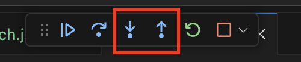

### Why use the VS Code Debugger?

The debugger allows you to pause your application at a specific point in the code. From there you can step through the program one line at a time in order to debug issues.

You can inspect the value of variables, see if specific conditional statements evaluates correctly and easily tell which lines of code are being skipped.

This is a great way to find issues in your code if you cannot tell why a bug is happening.

### Configuring to debug node

To work with the debugger your will need a launch configuration. Create a file called `.vscode/launch.json` with the following contents:

```json
{
  "version": "0.2.0",
  "configurations": []
}
```

In `.vscode/launch.json` add the following block to the configuration array:

```json
{
  "type": "node",
  "request": "launch",
  "name": "1-counter.js",
  "skipFiles": ["<node_internals>/**"],
  "program": "${workspaceFolder}/0-node/1-counter.js"
}
```

The `program` value should be the path to the file you used to start your node applciation. The `name` value can be whatever you want. This is used in the dropdown to tell the debugger which launcg configuration to run.

### Configuring to debug node & typescript

In `.vscode/launch.json` add the following block to the configuration array:

```json
{
  "type": "node",
  "request": "launch",
  "name": "1-counter.ts",
  "program": "${workspaceFolder}/0-node/1-counter.ts",
  "preLaunchTask": "tsc: build - 0-node/tsconfig.json",
  "outFiles": ["${workspaceFolder}/0-node/out/**/*.js"]
}
```

The main difference between this example and the last example is the `preLaunchTask` value to run the typescript compiler before the code executes.

### Configuring to debug a react app

In `.vscode/launch.json` add the following block to the configuration array:

```json
{
  "type": "chrome",
  "request": "launch",
  "name": "Debug React App",
  "url": "http://localhost:3000",
  "webRoot": "${workspaceFolder}/1-react/src"
}
```

Make sure the `webRoot` value is the path to the source code for the react app and `url` matches the url used when starting the react app. You must start the react app seperately before starting the debugger.

## Debugging Basics

#### Adding a breakpoint

Breakpoints are places you want the debugger to pause when executing the program. To add a brakepoint click the left side of the line you want to break on and click the add breakpoint button.


### Starting the debugger

To open the debugging panel click the "Run and Debug" button on the left hand tool bar or press Control/Command + Shift + D.

Select the launch configuration from the dropdown and press play to run the node application. The debugger will run until it hits a breakpoint.


### Continuing the debugger

Once at a breakpoint The program will pause indefinitely until you press the continue button (or F5) to resume the program.


### Stepping through the code

From a breakpoint you can use the Step Over button (or F10) to step to the next line of code.


Notice on the left hand side you can see the values of the state and action variables.


If a line calls a function you can use the step into button to go inside the function. If you want to jump back out of the dunction you can use the step out button.



## Wrapping Up

The debugger is a powerful tool for troubleshooting bugs in node and react applications. It may takes some time playing around with the debugger to get used to stepping through code.

Source code: [atlas-vs-code-debugger](https://github.com/atlas-jswank/atlas-vs-code-debugger)
